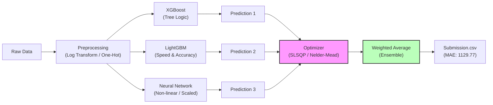

# Allstate Claims Severity - Advanced Ensemble Regressor
**Kaggle Competition Project**

## 📌 Project Overview / プロジェクト概要
Developed a high-performance regression model to predict the "loss" (claim severity) for Allstate Insurance.
Combining Gradient Boosting Trees (XGBoost, LightGBM) and Deep Learning (Neural Networks), achieved a robust ensemble model using automated weight optimization (Nelder-Mead/SLSQP).

Allstate（保険会社）の損害額（loss）を予測する回帰モデルを構築。
決定木モデル（XGBoost, LightGBM）とディープラーニング（Neural Network）を組み合わせ、さらに数学的最適化（scipy.optimize）を用いて「最適なアンサンブル重み」を自動算出するパイプラインを実装しました。

## 🏆 Key Achievements / 成果
- **Private Score (MAE):** 1129.77 (Approx. Top 35% / 3000 teams)
- **Improvement:** Reduced error by ~17 points from baseline (1146 -> 1129).
- **Technique:** Implemented a robust "3-Model Stacked Ensemble" that outperformed single models and simple averaging.

## 🛠️ Architecture / アーキテクチャ

## 💻 Technical Highlights / 技術的ハイライト

### 1. Hybrid Modeling (ハイブリッド・モデリング)
- **Diversity:** Combined "Tree-based" models (strong at categorical splits) with "Neural Networks" (strong at continuous scaling) to capture different data patterns.
- 「決定木が得意な論理的推論」と「ニューラルネットが得意な数学的推論」を組み合わせ、多様性を確保しました。

### 2. Automated Weight Optimization (重み最適化)
- Instead of manual guessing, used `scipy.optimize.minimize` to mathematically find the "Golden Ratio" of model weights based on validation data (OOF).
- 検証データ（Validation）に対する誤差が最小になるような重み配分（例: XGB 25%, NN 46%...）を自動計算し、人的バイアスを排除しました。

### 3. GPU Acceleration (GPU高速化)
- Enabled `device='cuda'` for XGBoost and `device='gpu'` for LightGBM/Keras to accelerate training on simple hardware.
- Kaggle環境のGPUをフル活用し、高速な実験サイクルを実現しました。

## 📂 Code Structure
- `analysis.ipynb`: Main experimentation notebook (EDA, Training, Optimization).
- `eda_backup.py`: Production-ready backup script.
